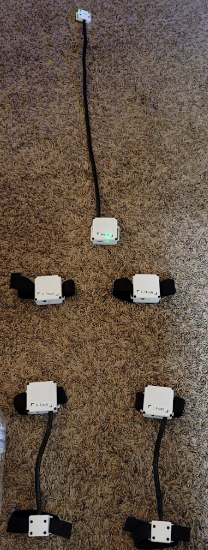
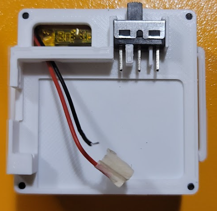
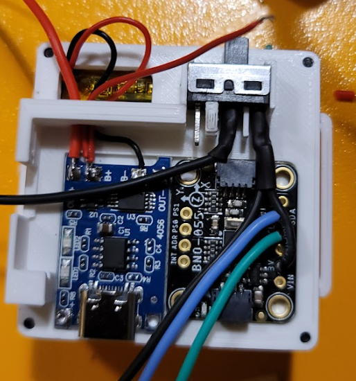
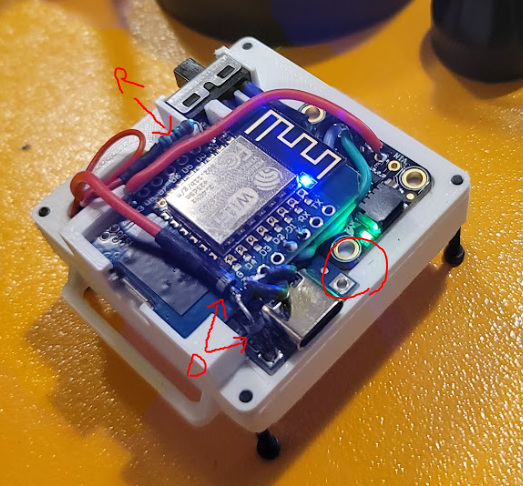
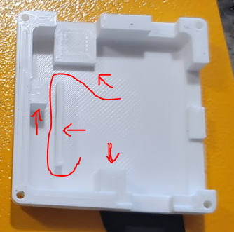
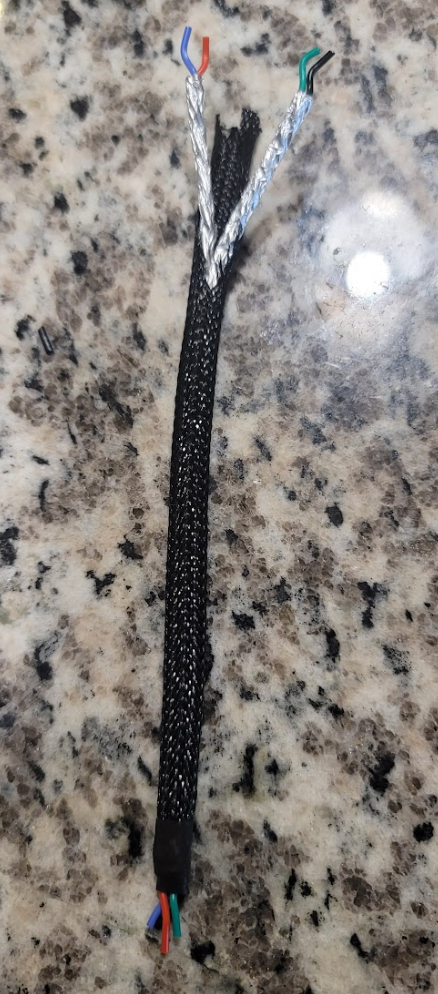
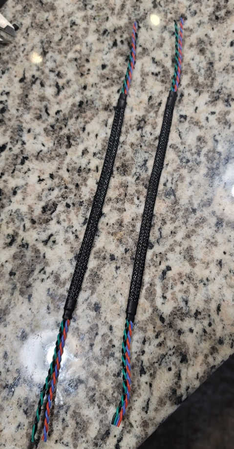

# Slime VR Domino Tracker
This is a compact design and it is a challenge to work with. I'm currently working on a V2. I don't recommend trying to build this unless you really like it and don't mind the extra work.

## Part List
List of parts that are measured for a tight fit with this case. Using other parts not on this list may require modifying the case.
* **Switches** - https://www.amazon.com/dp/B07FVM3XYR?psc=1&ref=ppx_yo2ov_dt_b_product_details
* **Battery** -  https://www.aliexpress.com/item/33021202630.html
* **ESP8266 ESP** - https://www.amazon.com/dp/B081PX9YFV?psc=1&ref=ppx_yo2ov_dt_b_product_details
* **Braided Cable Sleeve** - https://www.amazon.com/gp/product/B08D3RXL7T/ref=ppx_yo_dt_b_asin_title_o03_s00?ie=UTF8&psc=1
* **Adafruit BN055** - https://www.adafruit.com/product/4646
* **M2 x20** - 4 per tracker - https://www.amazon.com/dp/B08FMH5RC3?psc=1&ref=ppx_yo2ov_dt_b_product_details
* **M2 x10** - 4 per aux tracker
* **M2 Nuts**
* **Aluminum Foil**

## Notes
It took me 12 hours to assemble 5 + 3 aux trackers. I had to make sure that there was very little warping otherwise it didn't fit together.

## Tracker Assembly

1. Put the battery in the bottom tray and attach the middle tray.

2. Solder the battery and switch to the charge board but leave everything else dangling. (Note the ground wire attached to the switch is done differently between different photos)

3. Trim the reset button on the D3 Wemos. The case will press up against it if you don't.

4. Measure the IMU SDA, SCL, and GND wire and cut them. they need to be soldered under the board. I measured it by attaching the D1 mini and positioning the wires, marking them, then deetaching the board and solder them on.

5. Solder the Resistor and two diodes. Take note of the red circle, **the wires are required to be under the board or it wont fit**.

6. If it has an aux tracker then route the four wires and solder them to the top side of the board.

7. This step is hard. Put on the top. Take note of the notches inside of the top part of the case. There is one that keeps the D1 Mini from sliding back and some that keep the boards clamped down. You might need to cut some of it off if anything is blocking it. Its very sensitive to warping.

## Aux Tracker Assembly

1. Working on a V2.

## Aux Tracker Wires

1. Gather materials:
	* **Solid Core** wire
	* Aluminum Foil
	* Electric Drill
	* Braided Cable
	* Lighter or Heat Gun
	* Shrink Wrap

2. Measure out how long you need the wire for your ankle to feet and chest to waist. Make sure you make the braided cable the exact length but the actual solid core wire is a bit longer so it can reach the components when attached.

3. Grab a blue and red wire. Hold them together and insert one end into the drill like they are a drill bit and tighten it. With your fingers or some plyiers hold the other end of the two wires. 

4. Using the drill twist the wires to the desired amount.

5. Wrap with a small amount of aluminum foil. It should be one layer thick all around with little to no overlap.

6. Repeat for Black and Green wires.

7. Prepare the braided sleve by melting the ends (prevents it from unraveling).

